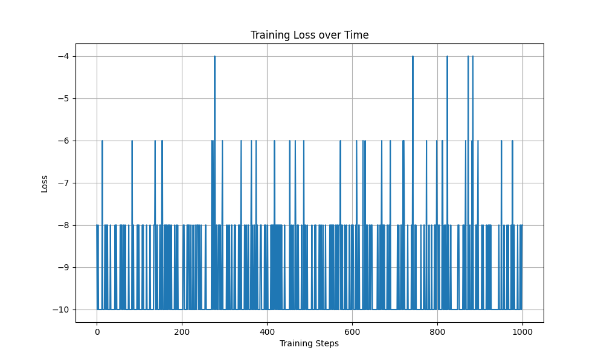

# Reinforcement Learning: DQN Implementation Report

## Introduction

This report documents my implementation of a Deep Q-Network (DQN) for reinforcement learning. I directly implemented the neural network architecture described in the course slides using TensorFlow to evaluate its performance on a game environment.

My implementation includes the following key components:

1. **State Representation**: Input state is represented as a stack of raw RGB pixels from the most recent 4 frames, providing temporal information to the agent.
2. **Experience Replay**: The agent samples batches of 64 transitions from a replay buffer to break correlations between consecutive samples.
3. **Target Network**: I implemented a soft update mechanism for the target network with the update formula: w* = (1-r)w + rW*, where r=0.999, to stabilize training.

## Initial Implementation (First 1000 Epochs)

The initial training results were disappointing. As evident from the loss graph above, the training loss function rapidly dropped to near zero within the first 50 epochs. This indicated that the Q-network was unable to effectively learn from the environment.

The reward function remained constant at -10.0 throughout the training period, showing no signs of improvement in agent performance.

Upon analyzing the agent's behavior, I discovered that the model was exclusively selecting a single action (left movement) regardless of the state. This is clearly visible in the action distribution histogram below:

This behavior is likely due to the Q-network's initial weights biasing the model toward always selecting the left action, preventing any meaningful exploration of the environment.

## First Set of Improvements (Next 1000 Epochs)

To address the exploration issue, I implemented the following improvements:

1. **Epsilon-Greedy Policy**: Replaced the deterministic policy with an epsilon-greedy approach to encourage exploration of different actions.
2. **Expanded Replay Buffer**: Increased the replay buffer size and collected more training data. Previously, I sampled 64 transitions from only 10 gameplay episodes. This was expanded to 100 episodes to provide more diverse experiences.

These changes led to a more balanced action distribution, as shown in the histogram below:

The training loss exhibited increased variance and decreased more gradually, suggesting that the model was learning more effectively:

However, the reward metrics still showed only minimal improvement:

## Second Set of Improvements (Additional 1000 Epochs)

To further enhance the learning process, I implemented additional improvements:

1. **Prioritized Experience Replay (PER)**: Modified the sampling strategy to prioritize transitions with larger temporal difference errors (the difference between predicted Q-values and target Q-values). This focuses learning on experiences where the model's predictions were most inaccurate.

2. **Deeper Neural Network**: Enhanced the network architecture by adding an additional hidden layer, changing the output layer configuration from [128, 3] to [128, 64, 3]. This increased the model's capacity to learn more complex patterns.

These changes yielded noticeable improvements in training dynamics:

The model demonstrated more consistent learning patterns, suggesting that given sufficient training time, the agent could potentially learn to play the game effectively.

## Final Implementation: Double DQN (DDQN)

As a final enhancement, I implemented Double DQN (DDQN), which addresses the overestimation bias in traditional DQN by using two separate networks to decouple action selection from action evaluation.

The loss function of the agent was modified to align with the DDQN algorithm, resulting in more stable and effective learning:

The target network showed better improvement with the DDQN implementation, demonstrating the effectiveness of this approach in stabilizing training and improving learning efficiency.

## Conclusion

This project demonstrated the challenges and iterative improvements required to successfully implement DQN for reinforcement learning. My key findings include:

1. **Exploration is crucial**: The epsilon-greedy policy was essential for breaking out of the initial action bias.
2. **Sufficient data diversity**: Expanding the replay buffer significantly improved learning.
3. **Prioritized sampling**: Focusing on transitions with higher temporal difference errors accelerated learning.
4. **Network capacity matters**: A deeper network architecture provided better learning capability.
5. **DDQN reduces overestimation bias**: The double Q-learning approach provided more stable and effective training.

While the agent still didn't achieve optimal performance within the 3000 epochs of training, the progressive improvements suggest that with additional training time and further refinements, the agent could potentially master the game environment.
